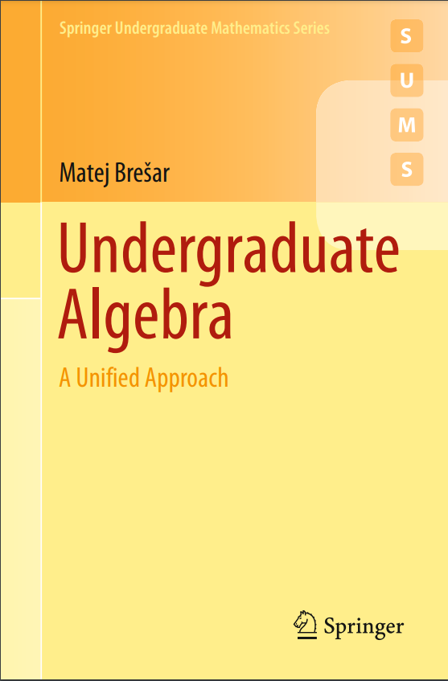

# Solucionário do Livro _"Undergraduate Algebra, A Unified Approach"_, Matej Brešar

  

## Capítulos Resolvidos

- [ ] Capítulo 1: Glossary of Basic Algebraic Structures
  - [x] 1.1: Binary Operations
  - [x] 1.2: Semigroups and Monoids
  - []
